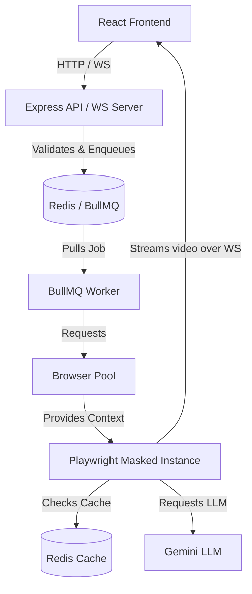

# AutoLearn - Autonomous Quiz & Course Completer

AutoLearn is a full-stack automation tool designed to autonomously complete Google Forms, Quizizz, and Infosys Springboard assignments using Headless Browser Automation (Playwright), LLM APIs (Gemini), and WebSockets for real-time video streaming of the process.

## 🏗️ New System Architecture

The system was heavily refactored into a **queue-based asynchronous architecture** to support stability, scalability, and anti-bot evasion. 

### Architecture Diagram



---

## 🔍 Core Components

### 1. Browser Pool (`browserPool.js`)
Instead of cold-booting a headless browser every time a user requests an automation (which is slow and memory-intensive), the server maintains a **pre-warmed pool of 3 masked Playwright instances**. 
- They are launched with `--disable-blink-features=AutomationControlled` to evade Google's anti-bot detection.
- `navigator.webdriver` is explicitly masked.
- If all 3 browsers are in use, new requests wait in a queue until a browser is released.

### 2. Job Queue (`jobQueue.js` & BullMQ)
We use **BullMQ** backed by **Redis** to manage incoming automation jobs.
- The user hits "Start Automation".
- The server places the job in the queue and immediately returns a Job ID.
- The user is placed in a "Waiting line" and told their position (e.g. "You are #2 in queue").

### 3. Background Worker (`worker.js`)
The `worker.js` listens to the BullMQ queue independently. 
- It pulls a job.
- Acquires a browser from the Browser Pool.
- Injects the live WebSocket connection so the browser can stream video frames to the frontend.
- Runs the automation (e.g., `handleGforms`).
- Safely releases the browser back to the pool and cleans up the WebSocket when complete.

### 4. Answer Cache (`answerCache.js`)
To save money and time on LLM (Gemini) calls, we cache the answers to quizzes.
- The answers are keyed by the Form URL.
- Stored in Redis with a Time-To-Live (TTL) of 3 hours.
- If a subsequent user submits the same form, the backend bypasses the LLM and instantly fills in the cached answers.

### 5. Rate Limiter (`rateLimiter.js`)
To prevent abuse (e.g., someone spamming the "Start" button and draining the Gemini API quota or crashing the browser pool):
- A Redis-backed rate limiter restricts each IP / Roll number to **3 jobs per minute**.

### 6. Dynamic WebSocket & Mobile App (`useAutoLearn.js`)
The React frontend is built as a Progressive Web App (PWA). 
- It uses `VITE_WS_URL` to dynamically connect to the backend, meaning you can access it via a mobile phone on the same Wi-Fi network and see the live stream of the headless browser doing work on your laptop.

---

## 🚀 How to Run Locally

### Prerequisites
- Node.js installed
- A Redis instance (you can use a free tier from Upstash)

### Environment Setup
1. **Frontend:** Create `autolearn-frontend/.env.development`
   ```env
   VITE_WS_URL=ws://localhost:3001
   ```
2. **Backend:** Update `autolearn-backend/.env`
   ```env
   REDIS_URL=redis://your-upstash-url.upstash.io:6379
   REDIS_PASSWORD=your_password
   GEMINI_API_KEY=your_gemini_key
   ```

### Starting the Servers
**Terminal 1 (Backend):**
```bash
cd autolearn-backend
npm install
npm run dev
```

**Terminal 2 (Frontend - Mobile Accessible):**
```bash
cd autolearn-frontend
npm install
npm run dev -- --host
```

*Open `http://localhost:5173` on your computer, or `http://<YOUR_LOCAL_IP>:5173` on your mobile phone.*
